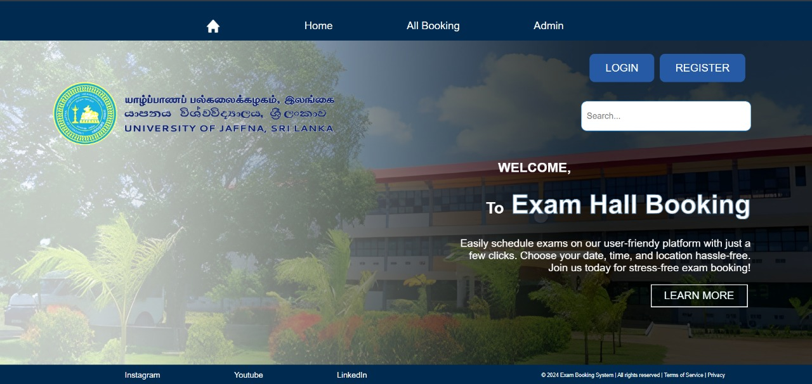
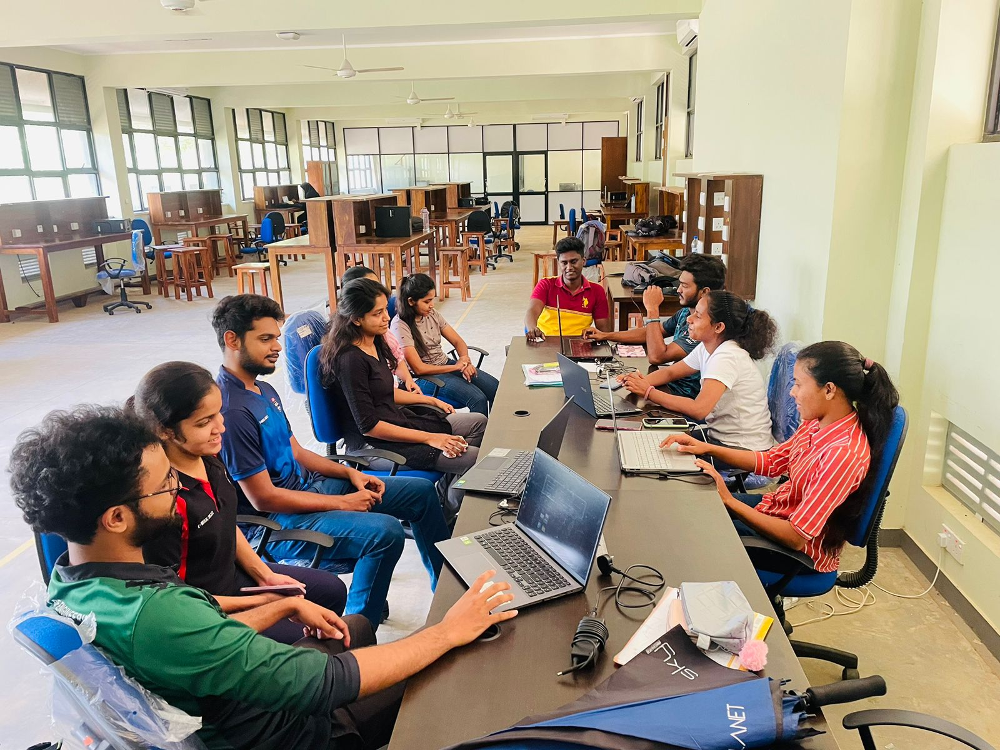

# University ExamHall Booking System

  

## Description
The Exam Hall Booking System streamlines the process of reserving exam halls within educational institutions. It caters to lecturers, academic staff, administration, and students, offering a user-friendly interface for booking halls like the Drawing Office Hall and Computer Department Exam Hall. This system enhances scheduling for various exam types while ensuring administrative oversight.

## ER Diagram

  

## Functional Requirements
- **User Accounts:** Lecturer and Administrative accounts for system access.
- **User Authentication:** Secure login for lecturers and administrators.
- **Exam Hall Management:** Availability checking, booking requests, scheduling, and reservation modifications.
- **Admin User Management:** Adding and managing administrative accounts.
- **Activity Logging:** Comprehensive logs for administrative actions.
- **Session Management:** Secure sign-out and inactivity timeout.
- **Access Control:** Role-based access for different user roles.

## Non Functional Requirements
- Performance , Security , Usability , Reliability , Maintainability

## Technologies Used
- **Backend:** .NET Core 8
- **Frontend:** ReactJS
- **Database:** SQL Server

## Jira Board
[Exam Hall Booking System Jira Board](https://univercitypoject.atlassian.net/jira/software/projects/KAN/boards/1)

## Team members

#### 👨‍💻 Project Manager :   [MANILKA B.P.K.](https://github.com/Kishara0)

#### 👨‍💻 Requirements Analysts :  [BANDARA R.M.S.C.A.](https://github.com/SinethB) ,  [WARUSAVITHARANA S.T.](https://github.com/Sesadi13)

#### 👨‍💻 Designers : [PERERA S.D.M.](https://github.com/ManashviCode) ,  [JAYASINGHE P.A.](https://github.com/ParamiJayasinghe)

#### 👨‍💻 Senior Software Engineers  :  [SWARNAKUMARA L.Y.S.B.](https://github.com/cydexcode) ,  [JAYAWARDHANA D.D.V.M.](https://github.com/ManurangaJay)

#### 👨‍💻 Software Engineers  :  [SANDUPAMA M.V.D.G.](https://github.com/GithminiSandupama) ,  [SENEVIRATHNE S.M.M.I.](https://github.com/manoda98) , - [JEEWANTHI U.B.T.](https://github.com/ThanujaJeewanthi)

#### 👨‍💻 Quality Assurance :  [LAKSHIKA K.R.S.](https://github.com/sachini24) ,  [WICRAMARACHCHI V.D.](https://github.com/DilushaWD)

  

<!--Typing Animation-->

  

