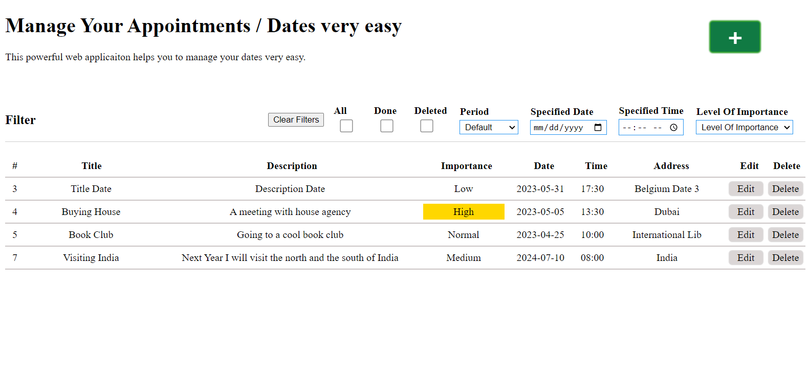
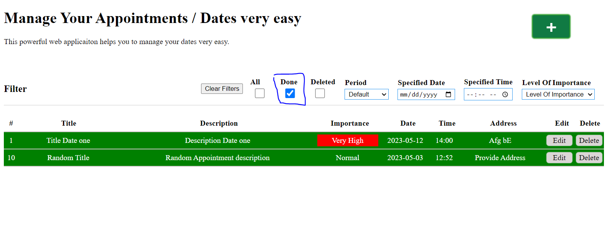
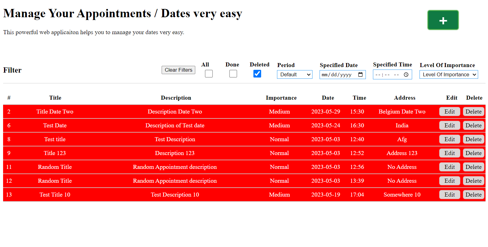

# Manage Your Appointments or Dates

This is full feature web application created in ASP.Net Web Api and React.JS to manage dates or appointments or anything similar.

### Todos before starting the app
1. Set the correct connection string
2. If necessary change the database name
3. For the client app you need to install the dependencies
    From your terminal inside the ClientApp folder, run "npm install"
4. For the Web Api dependencies, check the necessary dependencies in NuGet package manager.

> _The version of Web Api dependencies has to match the version .net framework otherwise you will get error(s)._

#### This project was part of my YouTube tutorials so you can also watch the video on YouTube [here](https://www.youtube.com/@coding-aqyanoos/videos).

> _Link to my YouTube Channel [https://www.youtube.com/@coding-aqyanoos](https://www.youtube.com/@coding-aqyanoos)_

> _Link to my website [https://aqyanoos.com](https://aqyanoos.com)_

## The landing page

## Filtered appointments(Done)

## Filtered appointments(Deleted)

### You have also other options to filter appointments like filtering based on dates, time, flags(level of importance),...

