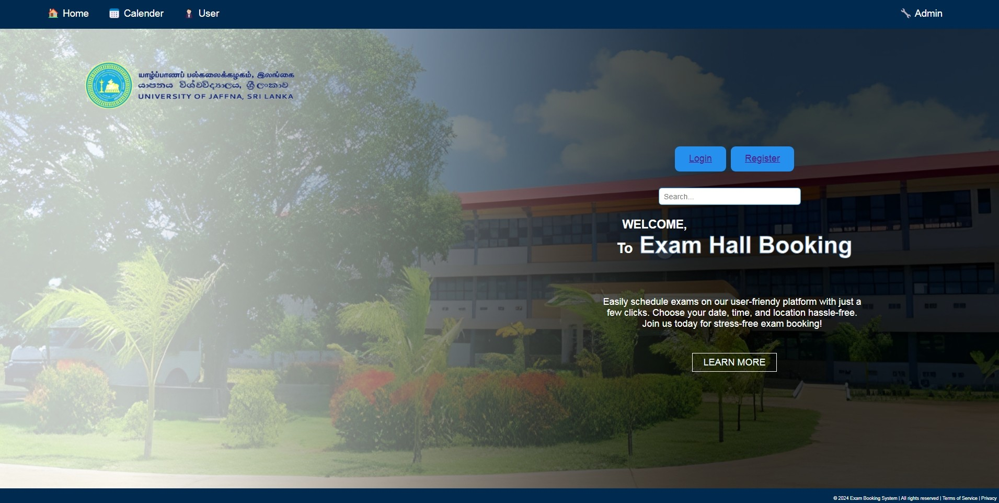

# University ExamHall Booking System

### Introduction
The Exam Hall Booking System streamlines the process of reserving exam halls within educational institutions. It caters to lecturers, academic staff, administration, and students, offering a user-friendly interface for booking halls like the Drawing Office Hall and Computer Department Exam Hall. This system enhances scheduling for various exam types while ensuring administrative oversight.

[Step by step User Guide for Exam Hall Booking System](https://github.com/CydexCode/ExamHallBookingSystem/wiki/User-Guide-for-Exam-Hall-Booking-System)

### Key Features: 
User Accounts and Authentication, User Profile Management, Exam Hall Management, Administrative User Management, Activity Logging, Session Management, Access Control and Permissions, Outlook Mail Notifications and Calendar Updates

[More about this Exam Hall Booking System](https://github.com/CydexCode/ExamHallBookingSystem/wiki)

[Requirement Analysis](https://github.com/CydexCode/ExamHallBookingSystem/wiki/Requirement-Analysis)

[ER , Use Case , Activity, Sequence Diagrams](https://github.com/CydexCode/ExamHallBookingSystem/wiki/ER-,-Use-Case-,-Activity,-Sequence-Diagrams)

[Project Architecture](https://github.com/CydexCode/ExamHallBookingSystem/wiki/Project-Architecture)

[Postman API Testing](https://github.com/CydexCode/ExamHallBookingSystem/wiki/Postman-API-Testing)

[Test cases](https://github.com/CydexCode/ExamHallBookingSystem/wiki/Test-Case)

### Technology Stack:

- **Languages** : HTML, CSS, JavaScript, C#
- **Tools** : VS Code, Visual Studio, MS SQL Server Management Studio, Jira, Postman, GitHub, Figma, Adobe Photoshop, draw.io
- **Frameworks** : .NET Core Web API, Bootstrap
- **Library** : React.js
- **Database** :  MySQL (Azure Server)

[How to setup this project]([https://github.com/CydexCode/ExamHallBookingSystem/wiki/Test-Case](https://medium.com/@cydexcode/exam-hall-booking-system-net-core-web-api-react-sql-server-dd93b9e80273)
  
### Jira Board
[Exam Hall Booking System Jira Board](https://univercitypoject.atlassian.net/jira/software/projects/KAN/boards/1)

### Team members

#### 👨‍💼 Project Manager :   [MANILKA B.P.K.](https://github.com/Kishara0)

#### 🕵️‍♂️ Requirements Analysts :  [BANDARA R.M.S.C.A.](https://github.com/SinethB) ,  [WARUSAVITHARANA S.T.](https://github.com/Sesadi13)

#### 🎨 Designers : [PERERA S.D.M.](https://github.com/ManashviCode) ,  [JAYASINGHE P.A.](https://github.com/ParamiJayasinghe)

#### 👨‍💻 Senior Software Engineers  :  [SWARNAKUMARA L.Y.S.B.](https://github.com/cydexcode) (Tech Lead) ,  [JAYAWARDHANA D.D.V.M.](https://github.com/ManurangaJay)

#### 👨‍💻 Software Engineers  :  [SANDUPAMA M.V.D.G.](https://github.com/GithminiSandupama) ,  [SENEVIRATHNE S.M.M.I.](https://github.com/manoda98) , - [JEEWANTHI U.B.T.](https://github.com/ThanujaJeewanthi)

#### ✅ Quality Assurance :  [LAKSHIKA K.R.S.](https://github.com/sachini24) ,  [WICRAMARACHCHI V.D.](https://github.com/DilushaWD)

  

<!--Typing Animation-->

  

